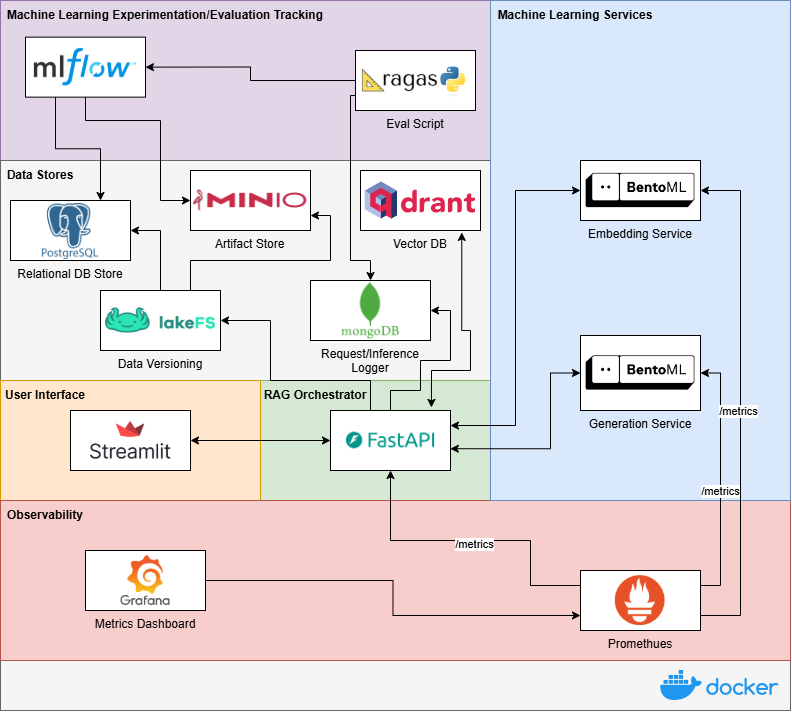
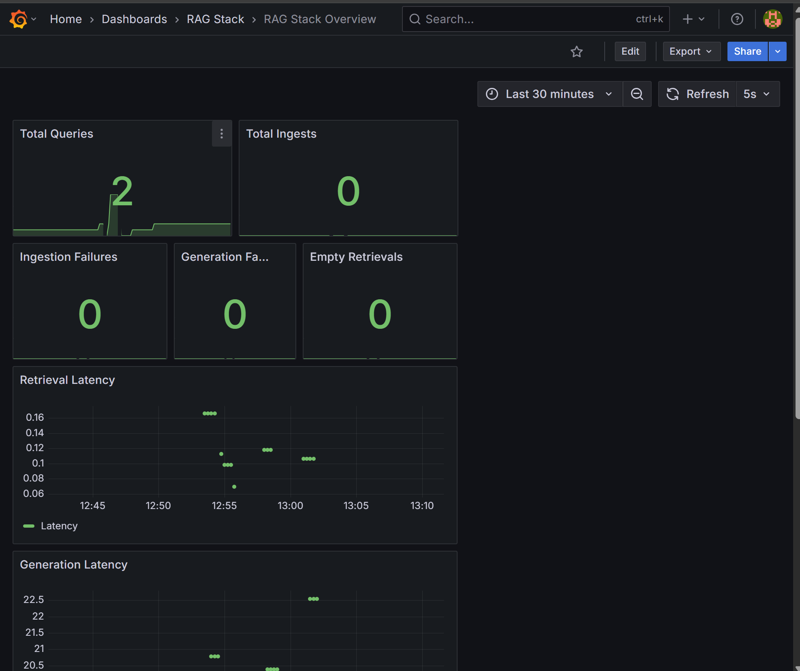
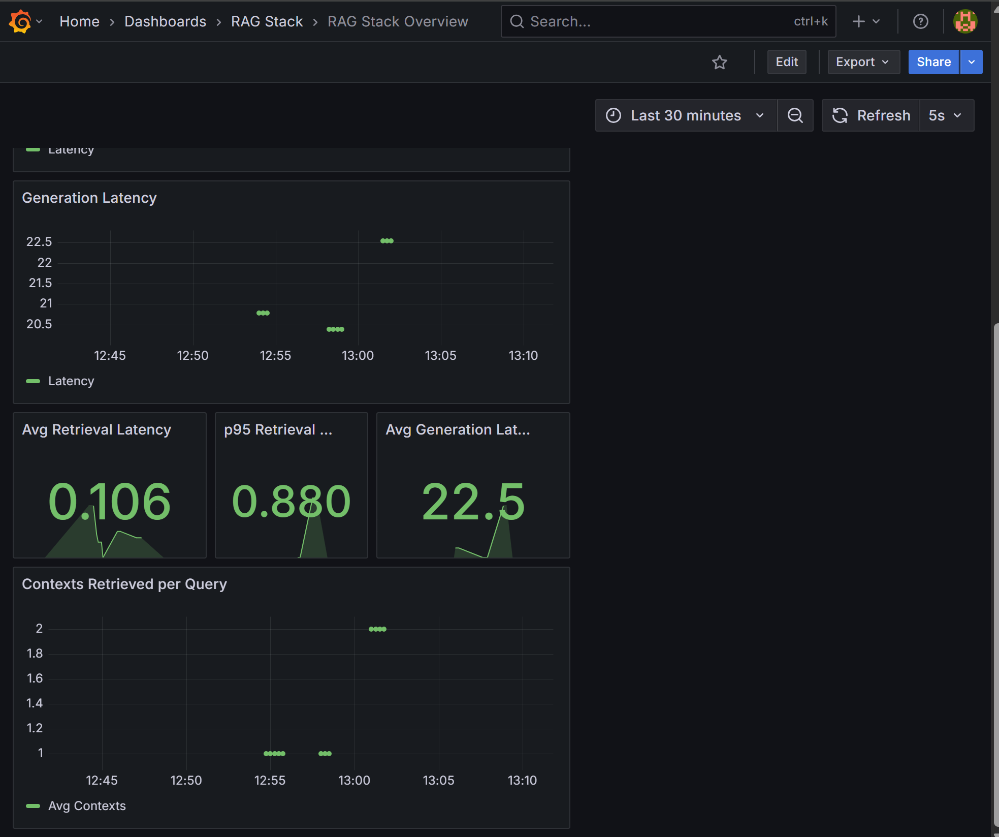

# MLOps Platform for LLM/RAG Systems

A production-oriented stack for building and serving **Retrieval-Augmented Generation (RAG)** systems with full CI/CD-style practices: dataset and document versioning, experiment tracking, containerised deployment, and observability.

## Why This Stack?

Designed to apply **MLOps** and **LLMOps** best practices to RAG: modular services, observability, evaluation, and traceability from source documents to embeddings.

## What's Included



- **FastAPI** orchestrator — `/ingest` and `/query` endpoints
- **BentoML** — embedding and generation model services
- **Qdrant** — vector store for retrieval
- **MLflow** — experiment and run tracking
- **Prometheus** — metrics (latency, throughput, model health)
- **Grafana** — dashboards over scraped metrics
- **Streamlit** — UI to interact with the RAG pipeline
- **MongoDB** — user interactions and model outputs for evaluation
- **LakeFS** — versioned document store; commit hashes stored with embeddings for traceability

## Data Versioning

Documents are versioned in LakeFS. Each ingestion creates a commit; the commit hash is stored with the document’s embeddings in Qdrant so every vector can be traced back to a specific document version. Updates create new commits so the vector store stays aligned with source data.

## Evaluation

Queries and model responses (including retrieved docs) are stored in MongoDB. This supports offline evaluation (e.g. with Ragas) on retrieval precision, groundedness, factual consistency, and completeness. Evaluation runs are logged in MLflow for comparison across model versions and retrieval strategies.

## Observability

Prometheus collects metrics; Grafana visualises them. Tracked metrics include ingestion latency, query latency, model health, vector search performance, and user interaction events. Dashboards cover both ingestion and query phases and can be extended with BentoML endpoint metrics.

**Example dashboards:**

<p float="left">
  
  
</p>

## Getting Started

All components run via Docker Compose:

```bash
docker-compose up --build
```

BentoML services may take a few minutes to start.

### LakeFS setup (document versioning)

1. Open the LakeFS UI at [http://localhost:8001/](http://localhost:8001/).
2. Create an account and store credentials in the `rag-orchestrator` `.env`:
   ```
   LAKEFS_USERNAME=<your-access-key>
   LAKEFS_PASSWORD=<your-secret-key>
   ```
3. In the LakeFS UI, create a repository for documents (see [LakeFS repo](assets/lakefs-setup-2.png)).

## Service URLs

| Service        | URL                      | Description                          |
|----------------|--------------------------|--------------------------------------|
| Streamlit App  | http://localhost:8501    | Main RAG interaction UI             |
| MinIO Console  | http://localhost:9001    | Artifact storage                     |
| Grafana        | http://localhost:4000    | Metrics dashboards                   |
| Prometheus     | http://localhost:9090    | Raw metrics                          |
| Mongo Express  | http://localhost:8081    | Stored interactions and outputs      |
| MLflow UI      | http://localhost:5000    | Experiments and metrics              |
| LakeFS UI      | http://localhost:8001    | Versioned data and artifacts         |

## Possible Extensions

- **Event-driven design** — Message broker and async publish/consume for services.
- **Kubernetes** — Deploy the same containers to a K8s cluster for production.
- **Secrets** — Use a secret manager for credentials instead of plain env vars.
- **Model registry** — Register models in MLflow and have BentoML serve from the registry.

All components are containerised; moving to Kubernetes or adding a broker is straightforward.
